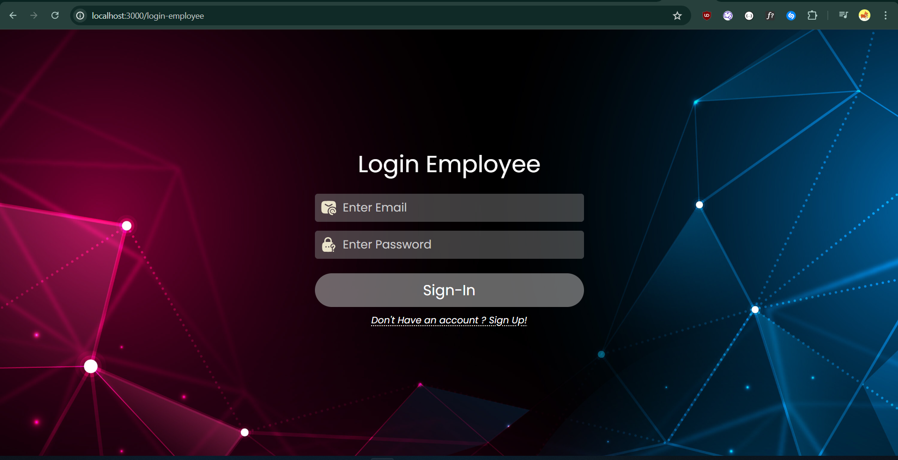
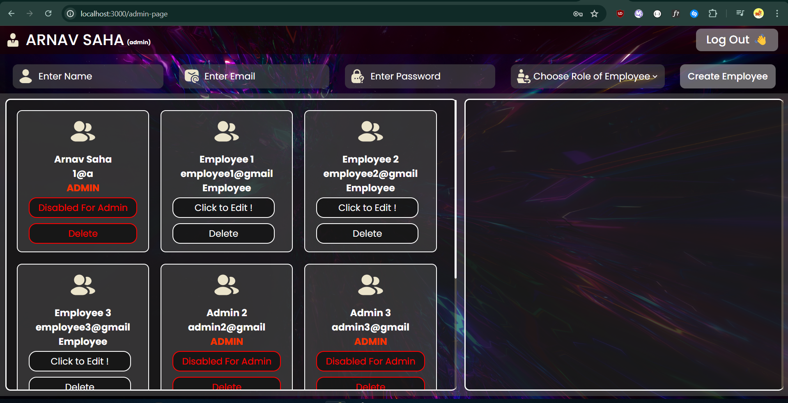
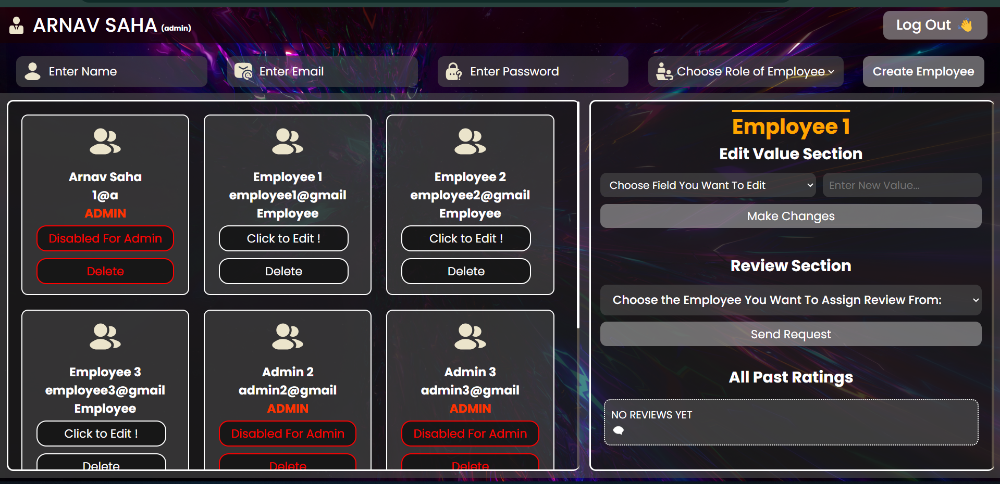
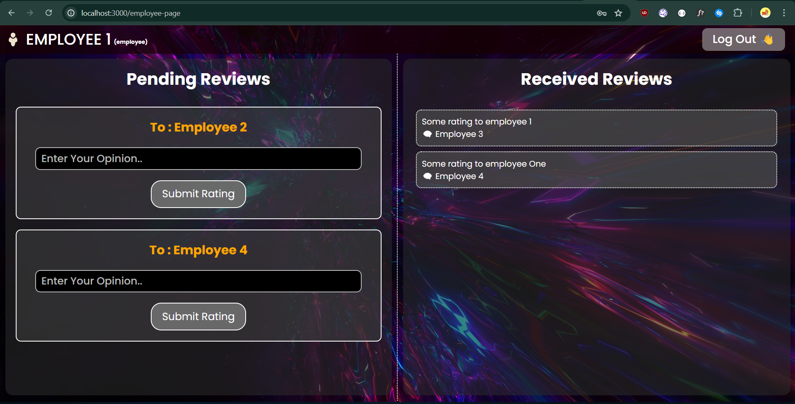

# Employee Review System

This app is my take on Employee Review System application. This is for the solution of coding ninjas skill test (Backend Express).
Let's go over all the individual pages and various functionality of my application.

## Landing Screen.

As you can see this is the landing page for my app. Here you can register as a new employee or you can go to the login page directly using the `Already have an account ? Sign in!` button.

## Login Page

So this is the login page. If you already have your credentials then you can login directly. If you need to register yourself then you can use the `Don't Have an account? Sign Up!` button and it will redirect you to the Register User Page.

## Admin Pannel (Will appear when any Admin logs in)

So this is the Admin Pannel Page. Although the login page is same for both Employee or Admin but the pannel that appears is dynamic i.e. if an employee logs in it shows employee pannel and vice versa.
Now as you see there are 4 sections to the page - Navbar, Create Employee section & Employee List and details.
Now when you click on `Click to Edit !` button the detail section of employee appears as shown below.

`Please Note the buttons are disabled for Admins. Any Admin can't modify any other Admin.`
So in this new portion you can edit the details of the employee, assign review from and see all the reviews given to the employee.

## Employee Pannel (Will appear when any non-admin employee logs in)

So this is the Employee View Pannel, as you can see it is divided into 2 sections, navbar and review section. On left you have `Pending Review` section i.e. the reviews pending from logged in employee to the mentioned employee. And on right we have the review section of the employee i.e the reviews he has received from other employees.

# Thank You.
